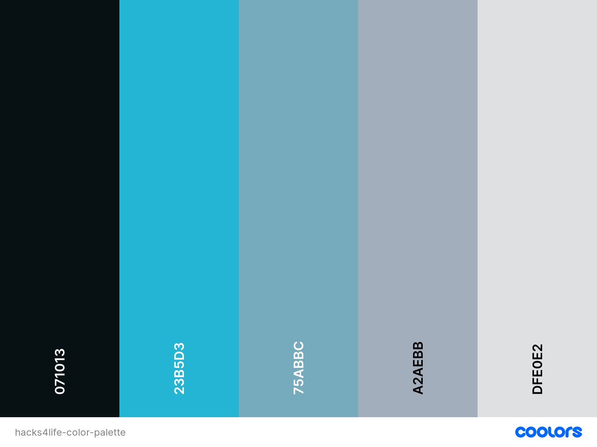
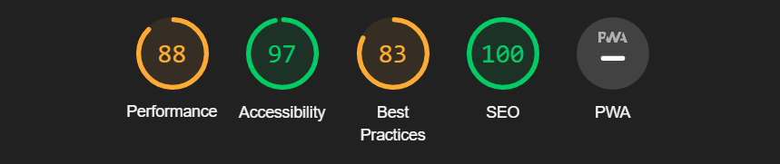

# Hacks4Life
Hacks4Life is a website for those who want to make their lives easier using simple lifehacks. Hacks4Life provides a monthly top 5 lifehacks to use on a daily base.

To make Hacks4Life a community website, we implemented a contact us option. This way everyone can send their own lifehacks to Hacks4Life and all of it's users.

---

# Table of Content
- [User Experience](#user-experience)
  * [Initial Discussion](#initial-discussion)
  * [User Stories](#user-stories)
- [Design](#design)
  * [Colours](#colours)
  * [Typography](#typography)
  * [Wireframes](#wireframes)
  * [Imagery](#imagery)
- [Features](#features)
  * [Existing Features](#existing-features)
  * [Future Features](#future-features)
- [Testing](#testing)
  * [Html](#html)
  * [CSS](#css)
  * [Accessibility](#accessibility)
  * [Known Bugs](#known-bugs)
- [Deployment](#deployment)
- [Credits](#credits)

# User Experience

## Initial Discussion
Hacks4Life is a website to teach people useful lifehacks to make their lives easier. 
The lifehacks shown on this site are considered the most useful lifehacks around.
Due to the discussion of which lifehack is more useful than the other, Hacks4Life provides a feedback/ contact form to reach out to us and state your case why your lifehack is more useful.

### Key information for the site
* What are the most useful lifehacks of present-day
* Which Lifehack is more useful than the other
* A way for people to contact the website with questions, recommendations and discussions.
---
## User Stories

### Client Goals
* To have a readable and an responsive website 
* To teach users genuinely useful lifehacks
* To allow users to give feedback on the showcased lifehacks
* To allow users to send their own lifehacks 

### First Time Visitor Goals
* I want to know what Hacks4Life is
* I want to learn the most useful lifehacks
* I want to know where to find Hacks4Life on social media
* I want an easy to navigate website

### Returning Visitor Goals
* I want to see an updated website with new useful lifehacks
* I want to contact Hacks4Life to contribute to the content
* I want to contact Hacks4Life to comment on the content

### Frequent Visitor Goals
* I want to see new content with new lifehacks
* I want to know if my suggested content is posted on the site

---

# Design
## Colours

The website uses a colour palette reaching from Rich Black to Gainsboro (lightly grey white) with 3 shades of blue to give the website a light theme. The colour palette was created using the [Coolors](https://coolors.co/) website.

## Typography
[Google fonts](https://fonts.google.com/) was used for the following fonts:
* Ubuntu is used for the headings. It's a sans-serif font.
* Cabin is used for the paragraphs. It's also a sans-serif font.

## Imagery
* The background images were found on [Pikwizard](https://pikwizard.com/)
* The lifehack images were found on [How to nest for less](https://howtonestforless.com/)
* The videos were found on [Youtube](https://youtube.com/)
* The social media buttons were found on [Fontawesome](https://fontawesome.com/)

## Wireframes
These wireframes were created using [Balsamiq Wireframes](https://balsamiq.com/wireframes/)
* [Computer screen Wireframe](https://github.com/Jdzelhorst/Hacks4Life/blob/main/wireframes/hacks4life-computer-screen.png)
* [Tablet screen Wireframe](https://github.com/Jdzelhorst/Hacks4Life/blob/main/wireframes/hacks4life-tablet-screen.png)
* [Phone screen Wireframe](https://github.com/Jdzelhorst/Hacks4Life/blob/main/wireframes/hacks4life-phone-screen.png)

---

# Features
## Existing Features

### The Navigation Bar
* Featured on the top of the page, with the logo in the top left corner and the navigation to the other sections in the top right corner.
* The navigation bar has the following links: Home, About us, Top 5 this month, Extra Videos and Contact Us.
* The navigation bar is fully responsive and changes colour when hoovered over them.

### The Eyecatcher
* Featured directly below the navigation bar is the eyecatcher image with our slogan
* The eyecatchers purpose is to the user excited for the content of this site.

### About Us Section
* This section is implemented to inform the user who we are and why the user should choose us.
* This information is explained in 2 small parapgraphs. Plain and simple to keep the user enthousiastic.
* The why choose us paragraph has a link to directly go to the contact form.

### Top 5 Images this month
* This is the core section of the site. Here is the main content found for the user.
* This section consist of 5 images chosen by the admins as the 5 best lifehacks of the month. These images are to be changed on a monthly base.

### Extra Videos
* This section features 2 extra videos with extra information next to it in a seperate paragraph
* The purpose of this section is to give our users more information and more fun lifehacks to use.

### Contact us
* This section features a contact form for users to send their own lifehacks to us. So we can use those for future monthly top 5's
* The user can also just send us feedback on the lifehacks we have posted on our site. It's not required to send their own lifehack.

### Footer
* The footer features our social media networks. From left to right: Twitter, Facebook, Instagram and Youtube
* The icons used are links to the separate websites of said social media platforms.

## Future Features
### Archive section
* The archive section is yet to be implemented. But it's core purpose is to show the user all the past monthly top 5 lifehack images. 
* The archive section is to be a seperate page with it's own link in the navigation bar. 

## Testing
The website was tested using the [W3C html validator](https://validator.w3.org/) for the html-code and [Css-validator from jigsaw](https://jigsaw.w3.org/css-validator/) for the css-code.

### HTML
8 errors occured in the html-validator:

#1: "Start tag seen without seeing a doctype first. Expected < !DOCTYPE html>".
Possible cause: a rookie mistake, never to happen again.
Fix: Implemented the !Doctype element at the top of the html page.

#2 and #3: "End tag section seen, but there were open elements" and "unclosed element div". (on line 46 and 55)
Possible cause: I added the div element later on in the section and it seems I forgot the closing tag.
Fix: Added a closing tag to the div on line 46

#4 and #5: 2 time the "The frameborder attribute on the iframe element is obsolete. Use CSS instead." (on line 95 and 98)
Possible cause: I copied the element from the "copy embed" function on youtube. The frameborder seems to be implemented by default.
Fix: Removed the frameborder attributes on both iframe elements.

#6: "Attribute type not allowed on element textarea at this point." (on line 122)
Possible cause: Initially I implemented the text-type as input for the contact-form, I changed it to textarea to make the possible feedback message larger.
Fix: Removed the type attribute from the textarea element in the contact-form

#7 and #8: Two times "The value of the for attribute of the label element must be the ID of a non-hidden form control." (on line 114 and 116)
Possible cause: I changed the IDs for the first and last name text-input in the contact-form and did not change the for attribute of the labels accordingly.
Fix: Changed the for attributes of both labels to the proper ID.

### CSS
3 erros occured in the css-validator:

#1 "Value Error : line-height none is not a line-height value : none"
Possible cause: I wanted to change the line-height in a media quary to override the existing line-height rule.
Fix: Changed the "none" value to "0".

#2 "Value Error : margin only 0 can be a unit. You must put a unit after your number : 25px 25% 25 25%"
Possible cause: I forgot the px value in the 3rd value
Fix: Added the px unit on the 3rd margin value.

#3 "Value Error : font-size smal is not a font-size value : smal"
Possible cause: I made a typo.
Fix: Added the second l for small.

### Accessibility
I tested the accesibility of the site with the lighthouse function in devtools, these were the results:

### Known bugs
* There are no known bugs at the moment.

## Deployment
* This website was deployed to GitHub pages. The steps to deploy are:
  - In the GitHub repository, navigate to the Settings tab.
  - From settings click on "Pages" on the left.
  - Here we select the main branch and click save. 
* This the live [Link](https://jdzelhorst.github.io/Hacks4Life/)

## Credits
### Mentor
* I would like to thank my mentor Jubril Akolade for helping me through this project and his helpful feedback.